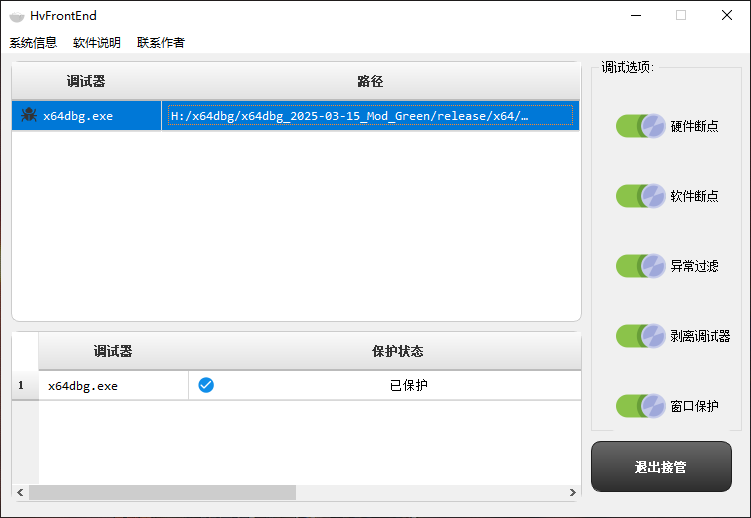
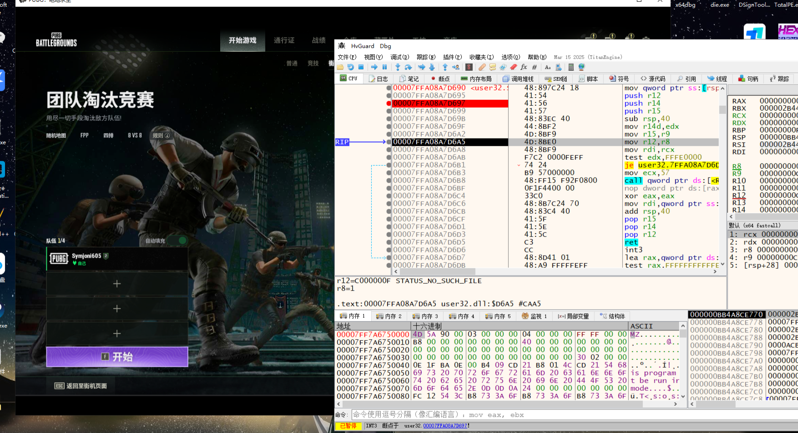
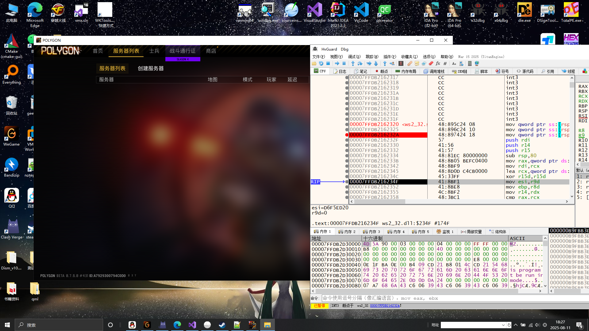

# HvGuardDbg

基于 **VMX / EPT** 的虚拟化防护与反调试框架，专为 **逆向工程、安全测试、驱动级调试** 等高强度防护场景设计。  
通过内核级虚拟化与用户态接口相结合，实现 **调试器保护、反反调试与动态控制**。

---

## ✨ 主要功能

- **虚拟化保护**  
  - 基于 VMX / EPT 的内存访问控制  
  - 支持动态策略切换与安全隔离  

- **调试器防护**  
  - 隐藏硬件断点与软件断点  
  - 过滤异常事件 (VEH / UEF)  
  - 避免调试窗口被检测  

- **反反调试机制**  
  - 针对 EAC、BattleEye 等反作弊环境的检测规避  
  - 内核级异常注入与拦截  

# 📸 软件截图

## 软件图
这里展示前端界面、控制面板等  

  

---

# 🎮 游戏测试截图

## 游戏测试图
这里展示在游戏环境下的调试保护效果  

  
   

